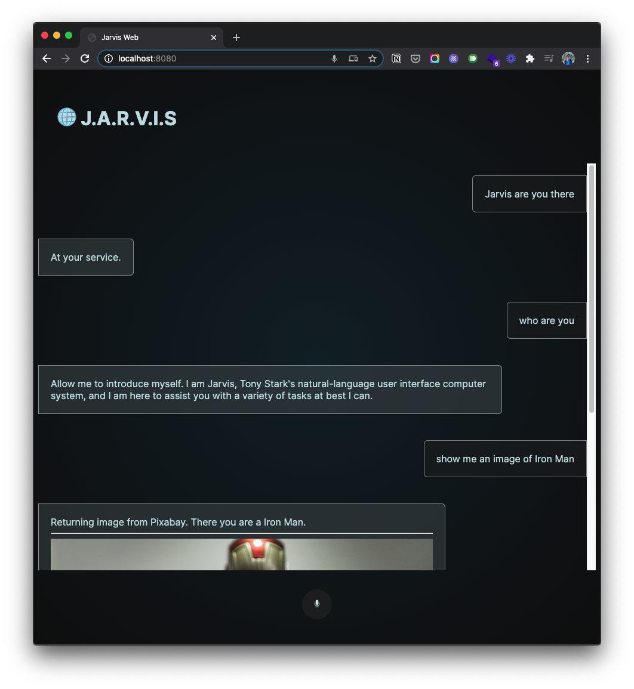
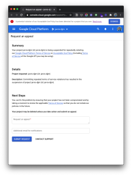
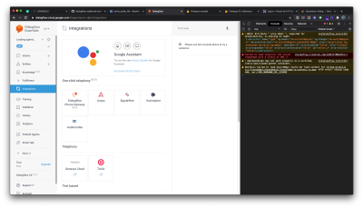

# JARVIS Web



Video Demo on [YouTube](https://youtu.be/DjilS2LzHyY)

## About

"JARVIS Web" is a web voice assistant app that resembles the fictional character "JARVIS", a virtual AI assistant from the comic/movie Iron Man. The app is built with `DialogFlow`, `Node.js`, `Firebase Functions`, `actions-on-google`, `Socket.io` and `Pixabay API`. Part of the project is enabled by a [previous project](https://github.com/jasontsemf/jarvis). For more information please find the [blog](https://jason1996429.wordpress.com/2020/11/23/hello-computer-wk4-jarvis/) for more information.

## Features

Welcoming
React to waking
Introduce what he is
Tell the user what he can do
Image search
Ask the user to pick and play the corresponding sound effects from the movie
Respond to compliments
Schedule an event
Read out events
Ask about a day
Ask about how many days until the day
React to unavailable request
Goodbye

## Technical Development

The task for this final project is to essentially connect the dots, giving the `Dialogflow` a front end, meanwhile replacing `SSML` with native JavaScript. In addition to just text, having a frontend means I will be able to provide image contents, that is why I am also including an image search function.

### Connecting `Node` to `Dialogflow`

Code below is a direct reference from [Nicole He](https://github.com/nicolehe/ITP-hello-computer-f20/tree/main/week6).

``` js
const sessionClient = new dialogflow.SessionsClient({
    keyFilename: process.env.KEYFILENAME
});
const projectId = "jarvis-ai-oxwx";


app.use(express.static("public"));

const PORT = process.env.PORT || 8080;
const server = app.listen(PORT, () => {
    console.log(`listening on port ${PORT}`);
});
const io = socketIO(server);


io.on("connection", (socket) => {
    console.log("new user: ", socket.id);

    // receive what the person said from the browser

    socket.on("send to dialogflow", (data) => {
        console.log(data);
        sessionClient
            .detectIntent({
                session: sessionClient.projectAgentSessionPath(projectId, "1"),
                queryInput: {
                    text: {
                        text: data.query,
                        languageCode: "en-US"
                    }
                },
            })
            .then((response) => {
                const result = response[0].queryResult;
                console.log(result);

                let params = result.parameters.fields;
                let text = result.fulfillmentText;
                let intent = result.intent.displayName;
                socket.emit("stuff from df", {
                    params,
                    text,
                    intent
                });

            });
    });
});
```

### Frontend

A holly grail hamburger layout is incorporated into the frontend design - a top bar, the main content window, and the footer. While the conversation goes on, the text bubble will be populated and appended to the window. Using `jQuery`, a very simple fade-in effect is implemented.

``` js
// speech synthesis
const speak = (text) => {
    // create British male voice
    let utterThis = new SpeechSynthesisUtterance(text);
    var voices = synth.getVoices();
    var selectedOption = voices[50];
    utterThis.voice = selectedOption;
    // create dialog bubble
    let itemDiv = document.createElement("div");
    itemDiv.className = "item";
    let computerSpeechDiv = document.createElement("div");
    computerSpeechDiv.className = "computer-speech-div";
    computerSpeechDiv.textContent = text;
    itemDiv.appendChild(computerSpeechDiv);
    // show dialog bubble, and scroll down
    $(itemDiv).hide().appendTo(".conversation").fadeIn(500, () => {
        conversation.scrollTop = conversation.scrollHeight;
    });
    synth.speak(utterThis);
    // toggle mic button status
    mic.id = "mic";
};
```

and the below line of CSS is very handy for getting a hamburger layout in a sec

``` CSS
grid-template-rows: auto 1fr auto;
```

### Audio playback

In order to play a sequence of audio files, a recursion method is possibly the most neat way to do so.

``` js
const playNextSounds = (sounds) => {
    if (sounds.length > 0) {
        const audio = new Audio();
        console.log(sounds);
        audio.src = sounds[0];
        audio.currentTime = 0;
        audio.play();
        sounds.shift();
        audio.addEventListener('ended', function () {
            return playNextSounds(sounds);
        })
    }
}
```

### Image search

``` js
// front end js code
const getImage = (phrase) => {
    let url = `/image/${phrase}`;
    let result = fetch(url, {
            mode: "no-cors"
        })
        .then((response) => response.text())
        .then((result) => {
            console.log(result);
            let imgUrl = result;
            let computerSpeechDiv = document.querySelector(".conversation").lastChild.lastChild;
            let br = document.createElement("hr");
            let img = document.createElement("img");
            img.src = imgUrl;
            // computerSpeechDiv.appendChild(img);
            $(br).appendTo(computerSpeechDiv);
            $(img).hide().appendTo(computerSpeechDiv).fadeIn(500, () => {
                conversation.scrollTop = conversation.scrollHeight;
            });
        });
}
```

``` js
// backend nodejs code
const fetch = require("node-fetch");
app.get("/image/:phrase", async (req, res) => {

    let phrase = req.params.phrase;
    phrase = phrase.replace(/\s+/g, '+').toLowerCase();
    console.log(phrase);
    let url = `https://pixabay.com/api/?key=${process.env.PIXABAYKEY}&q=${phrase}&image_type=photo&pretty=true`;
    fetch(url, {
            mode: "cors"
        })
        .then((response) => response.json())
        .then((result) => {
            console.log(result);
            let imgUrl = result.hits[randomNumber(0,3)].webformatURL;
            res.send(imgUrl);
        });
});
```

## Harsh Lesson



Please, never ever upload your authentication files or API key to a public environment, like GitHub. What I experienced at the very last minute was my `Google Cloud Project` got suspended, as possibly some hacker exploited my `service-account.json` file and used it for bitcoin mining. Therefore Google shutdown my project and I have no access to the original project anymore. I had to copy all the `DialogFlow` intents line by line manually.



So the rule of thumb is, start the `.gitignore` file right away whenever you creat authentication files in your working folder. If it is an API key, be very careful to delete that in the code and replace that with your corresponding `process.env.Something` variable name.

As the authentication file is no longer available to the public on GitHub, the only way to have your project hosted online will be pushing your project straight to `Heroku` with the terminal CLI tool. Which might be less convenient then having `GitHub` to auto deploy changes to `Heroku`, but this is the way, to have the authentication file living on your host without security issues...

## Future Improvement

Like how [Nicole](https://github.com/nicolehe) suggested, I can easily turn this AI to be something more interesting by incorporating a more "Iron Man" like context, by giving some interesting functions that might appear in the movie, instead of something that the Google Assistant can do. I can easily come up with more examples for such case.

- ask about the status of the iron man armor
- ask JARVIS to perform some very complicated scientific task
- call Pepper Potts
- be even more creative

Definitely I was so bounded by the idea of a practical voice assistant that works for us in real life.
